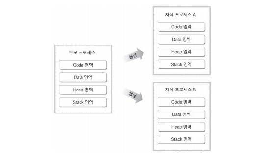

# MultiProcess vs MultiThread vs SingleThread

# Background

**과거:**

**Memory의 속도 >> Processor의 속도**

**→ cpu의 computation을 기다렸음.**

**현재:** 

**Memory의 속도 << Processor의 속도**

**→ Processor가 워낙 빨라 memory를 기다림.**

**⇒ I/O bottleneck**
solution: multi-programming

# Multi Process

## Concurrency

여러 작업을 조금씩 돌아가면서 진행하는 것.

이때, 작업을 A → B로 바꿀 때 **Context Switching**이 발생함.

## Parallelism

여러 작업을 동시에 진행하는 것.

여러 개의 core를 동시에 사용하여 작업을 분담.

⇒ Concurrency는 프로그램적으로 생각할 수 있고, Parallelism은 물리적이라 생각할 수 있을 것 같다.

## Process

Process 단위로 쪼개서 **독립된 메모리 공간**을 만들어 준다.

- 독립되어 있으니, Protective 하다.
- Memory, I/O State의 Switch Overhead가 높다.
- Sharing Overhead가 높다.

→ IPC(Inter Process Communication), 세마포어, 큐, 공유메모리

- Process Creation 비용도 많이 든다.
fork를 통해 Process를 복사해야함.

# Multi Thread

- Switch/Sharing Overhead가 낮다
- Thread Creation 비용이 낮다
- Memory, I/O state가 독립적이지 않아 보호되지 않는다
    
    ### 동시성 문제
    
    - 자원을 공유하기 때문에 데이터 신뢰성 보장 X
    - 쓰레드 동기화
        
        한 번에 하나의 Thread만 공유 자원에 접근.
        (ex) Java의 monitor 적용. synchronized 키워드.
        
    - Race Condition
        
        공유 자원에 접근하는 순서가 결과값에 영향을 준다.
        
    - DeadLock
        
        서로 상대방의 작업을 기다리면서 아무것도 하지 못한다.
        
    - Thread Dump
        
        동기화 문제를 분석할 수 있는 Tool
        

# Single Thread

⇒ 위에서 나오는 문제들 중 Context Switching이 많은 비중을 차지 하고 있음.

- SingleThread에는 Context Switching X
- 동시성 문제 X
- 연산량이 많은 작업이 존재하면, 이 작업이 끝나야 가능함
- 에러 발생 시 Program 자체가 멈출 수 있음
- C10k Problem ⇒ Single Thread + async + non blocking I/O model로 해결
    - Webflux
    - JS - single thread
    - node.js의 event loop