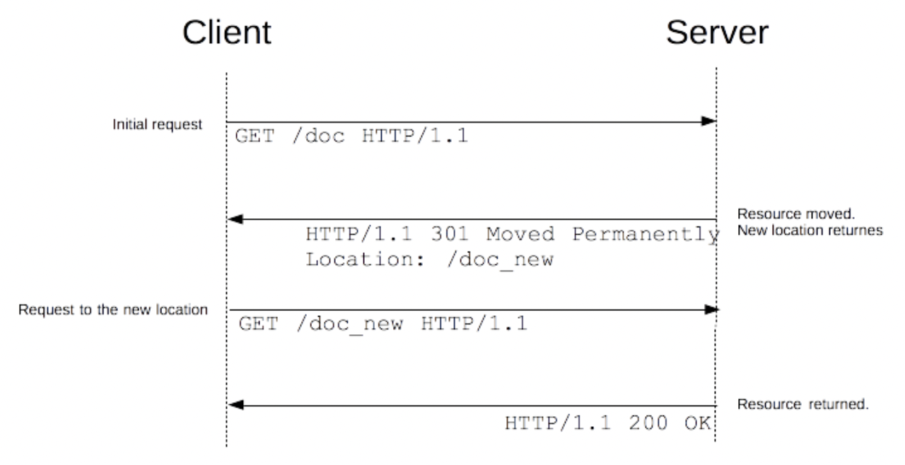

# Untitled

## **1. 3.xx 리다이렉트 피하기.**

[Redirections in HTTP](https://developer.mozilla.org/ko/docs/Web/HTTP/Redirections)



Client → Server 로 요청을 했는데,
Client ← Server 로 Redirect 응답을 줌.

Client → Server 로 응답 받은 URL을 사용하여 즉시 로드 되고, 사용자는 알지 못하고, 성능이 저하됨.
Client ← Server 로 200 OK와 함께 redirect된 자원이 로드됨.

## 리다이렉션 종류 3가지

### 영속적인 리다이렉션

영원히 지속되어야 할 때 : 원래 URL이 사용되지 않아야 하고, 새로운 URL만 사용되어야 한다면 사용.

301 (Moved Permanently) : GET을 사용할 때 / GET으로 바꾸어서 처리.

308 (Permanent Redirect) : GET이 아닐 때 동작의 모호함을 제거하고자 만들어짐.

### 일시적인 리다이렉션

특정 리소스는 표준 위치로 접근이 안되고, 특수한 경로로 접근 해야 할 경우에 일시적으로 리다이렉트 하여 접근 하게 해줌.

302 (Found) : GET / GET으로 변경 / GET으로 변경 X → 일시적으로 웹 사이트가 이용 불가능 할 때 사용.

303 (See Other) : GET / GET으로 무조건 변경 → 페이지 리프레시를 막기 위해 PUT / POST와 사용.

307 (Temporary Redirect) : 변경 X → 302와 같고, GET이 아닐 때 302보다 더 좋음.

### 특수 리다이렉션

300 (Multiple Choice) : 다중선택. 수동 리다이렉션. 본문의 HTML 페이지 선택지가 나열됨. (드문 케이스)

304 (Not Modified) : 로컬에 캐시된 복사본으로 페이지 리다이렉트.

## 대체 방법.

### 1. HTML 리다이렉션

웹 개발자가 서버에 대한 제어권이 없을 때.

HTML 의 <head> 내에 <meta>태그 & http-equiv속성으로 사용.

```jsx
<head>
	<meta http-equiv="refresh" content="0; URL='... ...'" />
</head>
// 0은 리다이렉션 전 브라우저가 대기할 시간 -> 0이 가장 성능이 좋음.
```

단지, HTML로만 동작함(Img, contents)X
브라우저에서 뒤로가기 불가. (정보가 없음)

### 2. JavaScript 리다이렉션

JavaScript의 window.location으로 새로운 페이지 로드.

```jsx
window.location = "http:// ... ... ";
```

JavaScript가 실행된 클라이언트에서만 동작.
어떤 조건이 충족됬을 때 리다이렉션을 한다는 점에서는 장점./

## 리다이렉션 사용 예

1. 도메인 앨리어싱

    [www.example.com](http://www.example.com) 일 때 example.com도 리다이렉션을 통해 사용할 수 있다.

    다른 도메인을 가지게 되었을 때도 리다이렉션을 통해 하나처럼 사용할 수 있다.

2. 링크 유지하기

    URL이 변경되었을 때, 리다이렉션을 통해 새로운 URL로 설정 가능.

3. 안전하지 않은 요청에 대한 일시적인 응답.

    PUT, POST, DELETE 등에 대해서 새로고침 후 다시 동작 하는 것을 막을 수 있음.

4. 긴 요청에 대한 일시적인 응답.

    303과 같은 진행률, 동작 취소 관련 페이지로 리다이렉트를 통해서 서버 상에서 많은 시간이 걸릴 때 일시적 응답이 가능.

## **2. meta-refresh 사용 피하기.**

```jsx
<head>
	<meta http-equiv="refresh" content="0; URL='... ...'" />
</head>
// 0은 리다이렉션 전 브라우저가 대기할 시간 -> 0이 가장 성능이 좋음.
```

> 일정 시간이 지나면 사용자를 새 URL로 이동시키는 메타 태그.
일부 브라우저에서는 지원되지 않아 사용자에게 혼란을 초래.
W3C는 권장 하지 않음.
Google은 301 리다이렉션 사용을 권장.

## **3. CDN 사용 ( Content Delivery Network )**

느린 응답속도 / 느린 다운로드 속도 를 극복할 수 있는 기술.

분산된 서버로 이루어진 플랫폼으로 웹 페이지 콘텐츠 로드 지연을 최소화.

CDN이 없으면 : 서버는 모든 요청에 대해 일일이 응답해야함. 엄청난 트래픽과 부하 유발.

CDN이 있으면 : 물리적 위치별로 분산하여 더 가깝고 빠르게 콘텐츠 제공 가능.

## 작동 방식

### 예)

미국 클라이언트가 영국 서버 콘텐츠 요청 시,
CDN은 'PoP(Points of Presence)' : 전 세계의 여러 지역에 캐시된 버전의 웹 사이트 콘텐츠 저장. 을 이용하여 콘텐츠 제공.

## 로드 밸런싱.

- 사용자에게 콘텐츠 전송 요청을 받았을 때, 최적의 네트워크 환경을 찾아 연결하는 기술.
- 물리적으로 가장 가깝거나 / 트래픽이 비교적 여유로운 곳을 찾아주는 기술.
- GLSB (Global Server Load Balancing).

DNS의 발전된 형태.

- **health check**

    DNS : 서버의 상태를 알 수 없어서 서비스 실패 가능성이 있음.

    GSLB : 서버의 상태는 주기적 모니터링. 실패한 서버는 응답에서 제외하여 줄여가면서 더 빠른 성능 제공.

- **로드 밸런싱**

    DNS : Round Robin 사용. 정교한 로드 밸런싱 어려움.

    GSLB : 모니터링을 하기 때문에 로드가 적은 서버 IP를 받아와서 정교함.

- **(Latency 기반) + (위치 기반) 서비스**

    DNS : R.R 사용으로 네트워크 상 멀리 떨어진 위치의 서버가 연결 될 수 있음.

    GSLB : 물리적으로 가깝고 Latency가 작은 서버 우선 연결

## **4. 동시 커넥션 수 최소화 하기.**

- 동시 접속이 많을 경우에는 세션 조차도 오버헤드가 될 수 있음. (세션 객체는 메모리 안에 생성된 객체이기 때문)
- 로드 밸런싱에도 문제가 될 수 있음. (서버가 다운 될 수 있음)
- 커넥션을 맺고 끊을 때 조차도 지연이 발생할 수 있음.

## **5. 커넥션 재활용 하기.**

### 최신 기술

1. 병렬 커넥션 parallel

    여러 개의 TCP 커넥션을 통한 동시 HTTP 요청.

2. 지속 커넥션 persistent

    커넥션 맺고 끊음에서 발생하는 지연을 제거하기 위한 재활용.

3. 파이프라인 커넥션 pipelined

    공유 TCP 커넥션을 통한 병렬 HTTP 요청.

4. 다중 커넥션 multiplexed

    요청과 응답들에 대한 중재 기술.