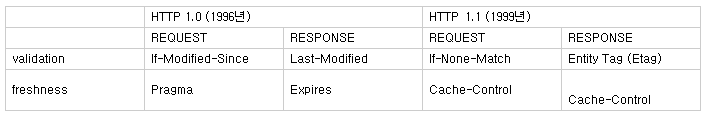
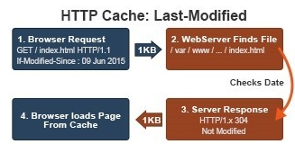
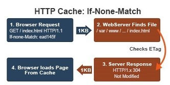
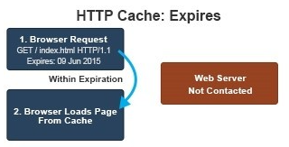
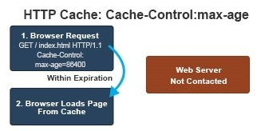

# Web 성능 향상 방법론 2. 자원의 크기를 최소화.

## **1. gzip 압축.**

### gzip의 성능.

gzip은 텍스트 파일을 압축할 때 최상의 성능을 낸다고 함.

웹 사이트는 HTML, CSS, JavaScript, JSON 등 대부분의 요소가 텍스트.


현재 대부분 브라우저는 gzip에 대한 기능 탑재.
HTTP/1.1 명세에 포함.

### gzip 압축 적용 사례.

1. Apache나 Nginx 등 Web서버에서 처리.
2. Tomcat이나 Weblogic 등 WAS에서 처리.
3. Servlet Filter를 등록하여 처리.
4. 정적인 파일을 미리 gzip으로 압축하여 처리.

## 2. HTML5 App Cache 사용.

[애플리케이션 캐시 사용하기](https://developer.mozilla.org/ko/docs/Web/HTML/Using_the_application_cache)

### 장점

- 오프라인 브라우징 : 유저들은 오프라인에서도 사이트를 탐색 할 수 있음.
- 속도 : 로컬에 리소스들을 캐싱함으로서, 로딩속도를 향상시킬 수 있음.
- 서버 부하 감소 : 브라우저는 서버에서 변경된 리소스들만 다운로드함.

### 활성화

```java
<html manifest="example.appcache">
	...
</html>
```

### cache manifest 파일

1. CACHE MANIFEST : 처음 다운로드 한 이후 캐시할 파일 기록.
2. NETWORK : 서버와의 접속이 필요한 파일들을 기록하며, 절대로 캐시되지 않음.
3. FALLBACK : 파일에 접속할 수 없을 때에 대체할 파일들을 기록.

### 캐시 갱신

1. 사용자가 웹 브라우저 캐시를 강제로 지웠을 때.
2. app cache가 프로그램에 의해 갱신되었을 때.
3. cache manifest 파일이 수정되었을 때.

```java
CACHE MANIFEST

# 2016-03-22 v1.0.1    // 갱신용으로 많이 사용.
test.html
test.css
test.js

NETWORK:
test.jpg

FALLBACK:
/ offline.html
```

### 주의

한 번 캐시 되면, 삭제되기 전까지는 캐시된 버전의 파일을 사용하게 됨.
→ 갱신 되는 시점을 잘 설계해야함. (서버 파일이 수정될 때 등.)

⇒ cache manifest 파일 내의 주석 부분을 수정하면 갱신 되는 효과를 볼 수 있음.

# 3. 자원을 캐시 가능하게 사용.

### 웹 캐시

1. **Browser Caches**
    - 브라우저 or HTTP 요청하는 Client에 의해 내부 디스크에 캐시.
    - 공유 Resource가 아니면 개인별로 한정되어 있음.
    - 뒤로가기, 방문한 페이지 재 방문시 장점을 보임.
2. **Proxy Caches**
    - Client나 Server가 아닌 Network상에서 동작.
    - 방화벽에 설치 되며, 대기시간/트래픽 감소, 접근정책, 제한 우회, 사용률 기록 등의 기능.
    - 한정된 수의 Client에게 무한대의 웹 서버 컨텐츠 캐시.
3. **Gateway Caches**
    - Server 앞 단에 설치되어 효율적인 분배를 통해 가용성, 신뢰성, 성능 향상.
    - Encryption / SSL acceleration, Load Balancing, Serve/cache static content, Compression 등 수행.
    - 무한대의 Client에게 한정된 웹 서버 컨텐츠 제공.

### 동작 순서

1. Browser가 서버에 index.html 파일 요청.
2. 몇 가지 header와 함께 index.html 내용과 응답.
3. 응답 헤더의 내용에 따라 캐시 정책 수행.

    Last-Modified, Etag, Expires, Cache-Control:max-age 

### 캐시 컨트롤 방법

1. HTML Meta Tags

    ```html
    <META HTTP-EQUIV="EXPIRES" CONTENT="Mon, 22 Jul 2002 11:12:01 GMT">
    <META HTTP-EQUIV="CACHE-CONTROL" CONTENT="NO-CACHE">
    ```

2. HTTP Headers

    

    Etag > Last-Modified  /  Cache-Control > Expires 우선순위

### 재요청 방법.

< Last-Modified>



1. 브라우저가 받았던 Last-Modified 값을 If-Modified-Since라는 헤더에 포함 시켜 페이지에 요청.
2. Server는 파일을 If-Modified-Since 값과 비교하여 동일하면 304 Not Modified, 다르다면 200 OK와 함께 새로운 Last-Modified값을 헤더에 전송.

< Etag >

Etag : 서버마다 생성하는 값이 다르며 파일마다 고유한 값을 가짐.



1. 브라우저가 받았던 Etag 값을 If-None-Match라는 헤더에 포함시켜 재 요청.
2. Server는 Etag값과 If-None-Match값과 비교하여 동일하면 304 Not Modified로 응답, 다르다면 200 OK와 새로운 Etag값을 응답 헤더에 전송.

### validation : Last-Modified & Etag

이 두가지 헤더는 validation을 체크 함.
validation 체크 전용 통신이 발생하고, header, cookie에 의해 데이터 전송(1kb)가 발생.

< Expires >



1. 브라우저는 받았던 Expires 시간을 비교하여 기간 내라면 Server를 거치지 않고 바로 캐시에서 페이지를 로드.
2. 기간이 만료 되었다면, Validation 작업 수행.

< Cache-Control>



1. 브라우저는 받았던 Cache-Control 중 max-age값(초)를 GMT와 비교하여 기간 내라면 Server를 거치지 않고 바로 캐시에서 페이지를 로드.
2. 기간이 만료 되었다면, Validation 작업 수행.

### freshness : Expires & Cache-Control : max-age

이 두가지 헤더는 freshness를 체크 함.
HTTP date 형태의 시간과 GMT를 사용.
Server가 Last Modified, Last Access Time을 기준으로 하여 일정 시간 이후로 Expires or max-age 설정.

### 캐시 전략

1. 일관된 URL 사용. 동일한 URL이면 페이지가 달라도 캐시 사용 가능.
2. 자주 변경되는 파일 / 고정되는 파일을 분리. → 최적의 freshness를 설정 할 수 있음.
3. 다운가능한 파일의 내용이 바뀌면 (URL)을 바꿈. → 수정된 버전 제공 가능.
4. SSL을 최소화. 암호화된 페이지는 캐시되지 않음.